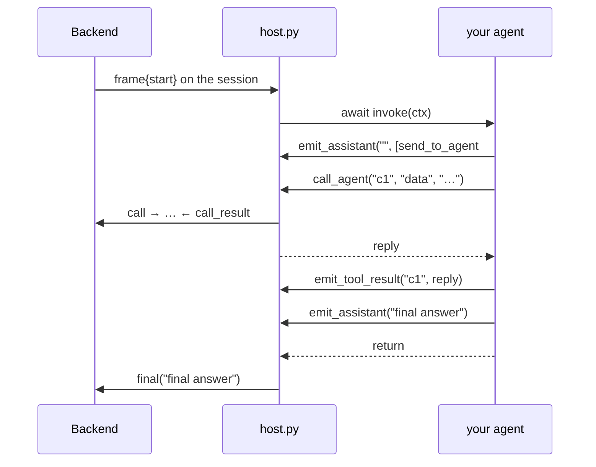

# Agent template

Copy this folder to build a vdagent agent. The template owns the gRPC side of the
Backend↔agent protocol; you write the **brain** with whatever you like — plain code, LiteLLM,
LangChain/LangGraph, the OpenAI Agents SDK.

An agent dials the Backend: it opens one long-lived session to the Backend's agent hub
(`VDAGENT_BACKEND`, default `localhost:50050`), identifies itself by `NAME`, and serves every turn
and compaction the Backend sends over it. It needs no listening port, so it can run on any machine
that reaches the Backend. There is no credential (demo): the Backend accepts any name listed in
`backend/config.yaml`.

Design: [`docs/superpowers/specs/2026-09-24-agent-template-design.md`](../../docs/superpowers/specs/2026-09-24-agent-template-design.md),
amended by [`2026-09-24-agent-connect-direction-design.md`](../../docs/superpowers/specs/2026-09-24-agent-connect-direction-design.md).

## What an agent is

```
agents/<name>/
├── README.md
├── pyproject.toml              # "vdagent-<name>"; template deps + whatever the brain needs
└── vdagent_<name>/
    ├── __main__.py             ┐
    ├── contract.py             ├ host: copied from _template, never edited
    ├── host.py                 ┘
    ├── agent.py                ← brain: NAME, build_agent(), your Agent
    ├── …                       ← anything else the brain needs (llm.py, prompts/, …)
    └── tests/
        ├── test_host.py        ← copied, never edited (catches a drifted host copy)
        └── test_agent.py       ← your tests
```

The **host** keeps the hub session open (reconnecting with backoff), runs turns concurrently,
routes agent-to-agent call replies, checks the turn rules, and reports failures. It is identical
in every agent; to change it, change `_template` and re-copy into every agent folder.

The **Backend** owns everything shared: the agent registry (`backend/config.yaml`), MCP tool
permissions, routing and deadlock checks for agent calls, and every agent's message history. An
agent keeps no state between turns.

## Create an agent

1. `cp -R agents/_template agents/<name>` and rename `agent_template/` → `vdagent_<name>/`.
2. In `agents/<name>/pyproject.toml`: set `name = "vdagent-<name>"`, `packages = ["vdagent_<name>"]`,
   and add the brain's dependencies.
3. In `agent.py`: set `NAME = "<name>"`, implement your agent, return it from `build_agent()`.
   Replace `tests/test_agent.py` with tests for it.
4. Root `pyproject.toml`: add `agents/<name>` to `[tool.uv.workspace].members` and
   `[tool.basedpyright].extraPaths`, `vdagent-<name>` to `dependencies`, and
   `vdagent-<name> = { workspace = true }` to `[tool.uv.sources]`. Run `uv sync`.
5. `Dockerfile.python`: add `COPY agents/<name>/pyproject.toml agents/<name>/pyproject.toml`
   next to the others.
6. Register it with the Backend: an `agents:` entry (one-line description, which peers see) in
   `backend/config.yaml` and `backend/config.compose.yaml`, a service in `docker-compose.yml`
   (`<<: *agent`, `command: ["python", "-m", "vdagent_<name>"]`), and `<name>` in `AGENTS` in the
   root `Makefile`.
7. Create `agents/<name>/.env` with `VDAGENT_BACKEND=localhost:50050` and the brain's settings
   (e.g. the LLM endpoint). In `docker-compose.yml`, give the service
   `env_file: agents/<name>/.env`.
8. Grant MCP tools in `backend/vdagent_backend/mcp/tools.py` (`ALL_AGENTS` and `PERMISSIONS`).
9. `uv run pytest agents/<name>`, then `make agent-<name>`.

## Configuration

Each agent is configured by its own `agents/<name>/.env` (gitignored; it never enters Docker
images). Precedence, highest first: `agents/<name>/.env`, the process environment, the nearest
`.env` above the agent folder (optional; only fills variables still unset).
`make agent-<name>` runs the agent from its folder (`cd agents/<name> && uv run python -m vdagent_<name>`).

| Variable | |
|---|---|
| `VDAGENT_BACKEND` | Hub address `host:port`, default `localhost:50050`. If the Backend does not list this agent's name, the session is refused and the process exits 2. |

Losing the session (Backend restart, network) cancels the in-flight turns — your brain sees
`asyncio.CancelledError` — and the host reconnects (0.5 s doubling to 10 s, ±20 % jitter).

## The contract

`contract.py` holds the types; its docstrings are the reference.

```python
class Agent(Protocol):
    async def invoke(self, ctx: InvocationContext) -> None: ...
    async def compact(self, previous_summary: str, messages: list[Message]) -> str: ...

def build_agent() -> Agent: ...          # in agent.py; raise AgentConfigError for bad settings
```

`ctx` (one per turn) gives you:

| Field / method | What |
|---|---|
| `invocation_id`, `task_id`, `user_id` | Ids of this turn. |
| `summary` | Rolling summary of this user's earlier tasks (`""` if none). Put it in your system prompt. |
| `history` | Uncompacted messages as OpenAI chat dicts; the last one is the inbound `[from: <sender>] …` message. |
| `peers` | Every other agent (`name`, `description`). |
| `mcp` | `url` + `token` of the Backend's MCP server (streamable HTTP, `Authorization: Bearer <token>`). |
| `max_steps` | Budget of LLM calls for this turn. |
| `await emit_assistant(content, tool_calls=())` | Record one assistant step. |
| `await emit_tool_result(tool_call_id, content)` | Record one tool result. |
| `await call_agent(tool_call_id, target, message) -> str` | Ask another agent for a `send_to_agent` tool call; returns its reply or `error: …`. |

A turn, step by step:



### Rules

| # | Rule | Checked by host |
|---|---|:-:|
| R1 | No memory between turns: `summary` + `history` is the whole truth. | |
| R2 | Emit an assistant step (with its tool calls) before any result or `call_agent` for them. A new step only once every call of the previous step has a result. Tool-call ids non-empty and unique in a step. | ✓ |
| R3 | Every tool call gets exactly one `emit_tool_result` — including `send_to_agent`: `call_agent`, then emit its reply. | ✓ |
| R4 | `call_agent` only for an unresolved `send_to_agent` call of the latest step, once per id; no result for that id while its call is pending. | ✓ |
| R5 | When `invoke` returns, every call is resolved and the last step has no tool calls — its content is the final answer. Nothing may be emitted afterwards. | ✓ |
| R6 | Tool failures become result content `error: …`; the turn continues. Model timeout → raise `AgentTimeoutError` (reported as `DEADLINE_EXCEEDED`). Anything else raised fails the turn (`INTERNAL`). | mapping ✓ |
| R7 | At most `ctx.max_steps` LLM calls. | |
| R8 | One agent object serves concurrent turns: keep per-turn state off `self`. | |
| R9 | Never swallow `asyncio.CancelledError` (task cancel from the Backend, or a lost session). | |

A broken rule raises `ContractViolation` at the offending call and fails the turn with
`INTERNAL: contract violation: …`, even if you catch it.

## Tools

| Kind | Executed by | Access controlled by | Report it with |
|---|---|---|---|
| MCP tool (`run_query`, `create_chart`, …) | Backend `/mcp` via `ctx.mcp` | Backend `PERMISSIONS` | `emit_assistant` → `emit_tool_result` |
| `send_to_agent` (name is fixed: `contract.SEND_TO_AGENT`) | Backend routes to the peer | Backend call checks (depth, deadlock, health) | `emit_assistant` → `call_agent` → `emit_tool_result` |
| Local tool | Your process | You | `emit_assistant` → `emit_tool_result` |

Local tools are fine, with these rules:

1. **Emit them.** Unemitted steps are not recorded: they vanish from the next turn's history and
   from the UI.
2. Anything the user or another agent must reference (`ds_…`, `ch_…`, `rp_…`) must be created
   through MCP. Never open `warehouse.db` or `backend.db` directly — that bypasses read-only access
   and per-user ownership.
3. No per-user state across turns.
4. Apply your own timeout (the Backend has no per-turn deadline; MCP calls use 30 s).
5. Never name a tool `send_to_agent`; avoid MCP tool names; truncate large results (the LiteLLM
   agents cut at 16 000 chars and append `…[truncated]`).

## Recipes

> **Unexecuted sketches.** They show where each framework plugs into the contract; check them
> against the framework's current docs and let `test_host.py`-style tests prove your version.

### LangChain v1 / LangGraph (`create_agent`)

Emit from inside the graph (middleware), not from a stream consumer, so R2 ordering cannot lag
execution: `aafter_model` runs before the model's tool calls execute, `awrap_tool_call` right
after each one.

```python
import json
from typing import Annotated

from langchain.agents import create_agent
from langchain.agents.middleware import AgentMiddleware
from langchain_core.messages import ToolMessage
from langchain_core.tools import InjectedToolCallId, tool
from langchain_mcp_adapters.client import MultiServerMCPClient
from langchain_openai import ChatOpenAI

from .contract import SEND_TO_AGENT, AgentTimeoutError, InvocationContext, Message, ToolCall


class EmitToContext(AgentMiddleware):
    def __init__(self, ctx: InvocationContext) -> None:
        super().__init__()
        self.ctx = ctx

    async def aafter_model(self, state, runtime):
        ai = state["messages"][-1]
        calls = [ToolCall(tc["id"], tc["name"], json.dumps(tc["args"])) for tc in ai.tool_calls]
        await self.ctx.emit_assistant(ai.text, calls)

    async def awrap_tool_call(self, request, handler):
        try:
            result = await handler(request)
            content = str(result.content)
        except Exception as exc:  # R6: tool failures go back to the model
            content = f"error: {exc}"
            result = ToolMessage(content, tool_call_id=request.tool_call["id"])
        await self.ctx.emit_tool_result(request.tool_call["id"], content)
        return result


def send_to_agent(ctx: InvocationContext):
    roster = "\n".join(f"- {p.name}: {p.description}" for p in ctx.peers)

    @tool(SEND_TO_AGENT, description=f"Send a message to another agent and wait for its reply. Agents:\n{roster}")
    async def _send(agent: str, message: str, tool_call_id: Annotated[str, InjectedToolCallId]) -> str:
        return await ctx.call_agent(tool_call_id, agent, message)

    return _send


class LangChainAgent:
    def __init__(self, model: ChatOpenAI, system_prompt: str) -> None:
        self.model, self.system_prompt = model, system_prompt

    async def invoke(self, ctx: InvocationContext) -> None:
        mcp = MultiServerMCPClient({"backend": {
            "transport": "streamable_http", "url": ctx.mcp.url,
            "headers": {"Authorization": f"Bearer {ctx.mcp.token}"},
        }})
        tools = [*await mcp.get_tools(), send_to_agent(ctx)]
        graph = create_agent(self.model, tools, system_prompt=f"{self.system_prompt}\n\n{ctx.summary}",
                             middleware=[EmitToContext(ctx)])   # built per turn: ctx is per turn (R8)
        try:
            await graph.ainvoke({"messages": ctx.history},     # OpenAI-shaped dicts are accepted
                                {"recursion_limit": 2 * ctx.max_steps + 1})
        except TimeoutError as exc:                             # map your client's timeout error
            raise AgentTimeoutError(str(exc)) from exc

    async def compact(self, previous_summary: str, messages: list[Message]) -> str: ...
```

If the recursion limit is hit, the graph raises before a final step: catch it and emit a final
assistant step without tool calls yourself (R5).

### OpenAI Agents SDK

Emit from run hooks: `on_llm_end` sees one whole model response (all its tool calls together,
which is one assistant step), `on_tool_end` gets a `ToolContext` with the `tool_call_id`.

```python
from agents import Agent as SdkAgent, RunHooks, Runner, function_tool
from agents.mcp import MCPServerStreamableHttp
from agents.tool_context import ToolContext

from .contract import InvocationContext, ToolCall


class EmitHooks(RunHooks):
    def __init__(self, ctx: InvocationContext) -> None:
        self.ctx = ctx

    async def on_llm_end(self, context, agent, response):
        text = "".join(part.text for item in response.output if item.type == "message"
                       for part in item.content if part.type == "output_text")
        calls = [ToolCall(i.call_id, i.name, i.arguments) for i in response.output if i.type == "function_call"]
        await self.ctx.emit_assistant(text, calls)

    async def on_tool_end(self, context, agent, tool, result):
        await self.ctx.emit_tool_result(context.tool_call_id, str(result))


def to_sdk_items(history):
    """Chat-completions dicts → Responses input items."""
    items = []
    for m in history:
        if m["role"] == "user":
            items.append({"role": "user", "content": m["content"]})
        elif m["role"] == "assistant":
            if m.get("content"):
                items.append({"role": "assistant", "content": m["content"]})
            for tc in m.get("tool_calls", []):
                items.append({"type": "function_call", "call_id": tc["id"],
                              "name": tc["function"]["name"], "arguments": tc["function"]["arguments"]})
        else:
            items.append({"type": "function_call_output", "call_id": m["tool_call_id"], "output": m["content"]})
    return items


class SdkBackedAgent:
    async def invoke(self, ctx: InvocationContext) -> None:
        @function_tool(name_override="send_to_agent")
        async def send_to_agent(tool_ctx: ToolContext, agent: str, message: str) -> str:
            """Send a message to another agent and wait for its reply."""
            return await ctx.call_agent(tool_ctx.tool_call_id, agent, message)

        async with MCPServerStreamableHttp(params={
            "url": ctx.mcp.url, "headers": {"Authorization": f"Bearer {ctx.mcp.token}"},
        }) as mcp:
            agent = SdkAgent(name="data", instructions=..., tools=[send_to_agent], mcp_servers=[mcp])
            await Runner.run(agent, to_sdk_items(ctx.history), hooks=EmitHooks(ctx), max_turns=ctx.max_steps)
```

Check that MCP tool calls reach `on_tool_end` with a `ToolContext` in your SDK version; otherwise
emit their results from a wrapper. `MaxTurnsExceeded` ends the run without a final step — emit
one (R5). Map the SDK's timeout exception to `AgentTimeoutError`.

### Both

- Put `ctx.summary` in the system prompt, feed `ctx.history` as the conversation.
- Cap model calls at `ctx.max_steps` (R7) and make sure the turn ends with an assistant step that
  has no tool calls (R5).
- Build per-turn objects inside `invoke`; the agent object is shared by concurrent turns (R8).

## Testing

`tests/test_host.py` runs the real host against a fake in-process Backend hub over gRPC; it exports
helpers for your own tests (a turn failure surfaces as `grpc.aio.AioRpcError` with its code):

```python
from .test_host import agent_stub, kinds, read_all, read_frame, start_frame

async def test_answers():
    async with agent_stub(MyAgent(llm=FakeLLM(...))) as stub:
        call = stub.Invoke()
        await call.write(start_frame())               # history: "[from: user] revenue by region?"
        frames = await read_all(call)
    assert kinds(frames) == ["message:assistant", "final"]
```

Answer agent calls by writing `agent_pb2.BackendFrame(call_result=...)` after reading the `call`
frame (see `test_concurrent_agent_calls_each_get_their_own_reply`). Inject fakes for anything
external (LLM, MCP) through your agent's constructor, and keep `build_agent()` the only place that
reads the environment. See `agents/orchestrator/` for a complete example.
