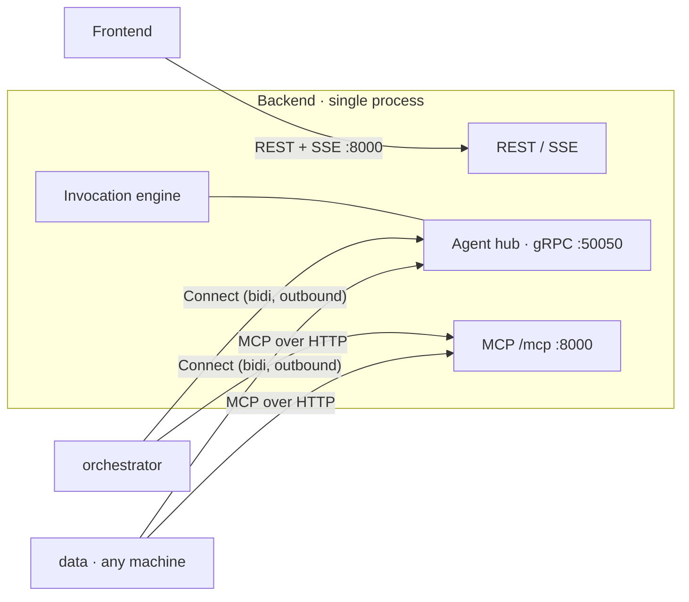

# vdagent — Agents Connect to the Backend — Design Spec

Status: draft for review · Date: 2026-09-24
Amends: `2026-09-24-vdagent-design.md` (D12, §2, §4.1, §4.3, §4.4, §4.6, §5, §7.1, §12, §13) and
`2026-09-24-agent-template-design.md` (T7, §3, §4, §9, §10).

> **Later change — tokens removed (demo).** C4 and the token half of C12 were withdrawn after
> implementation: `Hello` carries no token (field 2 reserved), the hub accepts any name listed in
> `config.yaml`, there is no `VDAGENT_AGENT_TOKEN_*` variable, and the Backend's optional `.env` is
> `backend/.env`. Everything below that mentions tokens describes the withdrawn design; the main and
> template specs describe the current one. Keep the hub on a trusted network.

## 1. Purpose and scope

Today every agent is a gRPC **server** and the Backend dials it at a configured `host:port`
(main spec D12). To develop or run an agent on any machine, including behind NAT or a laptop
firewall, reverse the direction: each agent process **dials the Backend**, identifies itself,
and keeps one long-lived stream over which the Backend multiplexes that agent's turns and
compactions.

The engine's semantics do not change: stacks, FIFO queues, the wait-for graph and call checks,
§5.3 frame validation, compaction, persistence, SSE events. Neither do agent brains (`agent.py`,
`llm.py`, `mcp_client.py`, prompts) or the `contract.py` API. What changes is the transport
seam: the proto service, the Backend's agent connections, the template host, deployment, and
agent configuration.

In scope: proto, Backend hub (replaces `engine/clients.py`), engine transport call sites, Backend
config and `.env` loading, template host and its re-copy into the five agents, per-agent `.env`
precedence, `.dockerignore`, compose, Makefile, READMEs, spec amendments, tests.

Out of scope: TLS (documented as required on untrusted networks; §9), several instances of one
agent at once (load balancing), agents registering names the Backend does not list, token
rotation, Frontend and MCP changes.

### 1.1 Decisions log

Decisions marked ◆ were taken as defaults while drafting; confirm or change them in review.

| # | Decision |
|---|---|
| C1 | **Agents dial the Backend.** One bidirectional gRPC stream (a *session*) per agent process, opened by the agent and kept open, with reconnect. The Backend never opens connections to agents. |
| C2 | ◆ **gRPC on a dedicated Backend port** (`agent_listen`, default `127.0.0.1:50050`), served by a `grpc.aio` server inside the Backend process. Rejected: WebSocket on the HTTP port (one port, proxy-friendly, but it loses gRPC keepalive and flow control and adds a second framing layer). |
| C3 | **Multiplexing by reference.** Every frame on a session carries `ref`: an invocation id for turns, a request id for compactions. The existing `BackendFrame`, `AgentFrame`, `CompactRequest`, `CompactResponse` are reused inside. |
| C4 | ◆ **Per-agent tokens with the same variable name on both sides:** `VDAGENT_AGENT_TOKEN_<NAME>` (e.g. `VDAGENT_AGENT_TOKEN_DATA`). The Backend accepts a session only if the name is in `config.yaml` and the token matches. The agent sends it in `Hello`. One root `.env` works locally; a remote machine puts only its agent's token in `agents/<name>/.env`. |
| C5 | **The registry stays in `config.yaml`**: name + description, used as the allowlist, the peer roster, and the MCP-permission key. `address` is removed. |
| C6 | **Healthy ⇔ an authenticated session is connected.** The polling health loop, `health_interval_s`, and `grpc.health.v1` on agents are removed. Dead peers are detected with gRPC keepalive. |
| C7 | ◆ **A new session for a connected name replaces the old one.** The old session is closed (`ABORTED: replaced by a new connection`) and its in-flight turns fail. This handles an agent restarted before the Backend noticed the old connection died. |
| C8 | **Losing a session fails its in-flight turns** with reason `UNAVAILABLE: agent disconnected`, using the existing failure path (stack patching, parent gets `ok=false`, root task fails). An in-flight compaction counts as a compaction failure (non-fatal, as today). |
| C9 | **Cancel is a frame.** Task cancel sends `Cancel(ref)`; the host cancels that turn's task (the brain sees `CancelledError`, contract R9). |
| C10 | **Turn failure is a frame.** The host sends `Failure(ref, code, detail)` with the gRPC status name it used to abort with (`DEADLINE_EXCEEDED`, `INTERNAL`, `INVALID_ARGUMENT`). The engine's failure reason keeps its format `<CODE>: <detail>`. |
| C11 | ◆ **Per-agent `.env` wins.** The host loads `agents/<name>/.env` with `override=True`, then the repo-root `.env` with `override=False`. Precedence: agent `.env` > process env > root `.env`. This also fixes a shell-exported `OPENAI_API_KEY` shadowing the agent's key. |
| C12 | **The Backend loads the repo-root `.env`** (process env wins) so it can read agent tokens. Its `VDAGENT_*` config overrides keep working. |
| C13 | **Clean cutover.** The `Agent` service, `GRPC_PORT`, agent-side health, and `AgentClients` are deleted; there is no dual mode. |

## 2. Architecture



Agents open two kinds of outbound connection, both to the Backend: the hub session (gRPC) and
MCP (HTTP, per turn, as today). An agent needs no listening port.

### 2.1 Session lifecycle

```mermaid
sequenceDiagram
  participant A as agent host
  participant H as Backend hub
  participant E as engine
  A->>H: Connect(); Hello(agent, token, runtime)
  H-->>A: Welcome
  H->>E: agent healthy (agent.status)
  E->>H: invoke(data, start)
  H-->>A: [inv_1] frame{start}
  A->>H: [inv_1] frame{message} / frame{call}
  H-->>A: [inv_1] frame{call_result}
  A->>H: [inv_1] frame{final}
  E->>H: compact(data, request)
  H-->>A: [cmp_1] compact
  A->>H: [cmp_1] compacted
  Note over A,H: connection lost
  H->>E: agent unhealthy; in-flight turns fail "agent disconnected"
  A->>H: reconnect with backoff; Hello …
```

## 3. Protocol (`proto/agent.proto`)

The `service Agent` block is replaced; all existing messages stay.

```proto
service AgentHub {
  // Opened by the agent. The first uplink message MUST be `hello`; the hub answers `welcome`
  // or ends the RPC with UNAUTHENTICATED (unknown agent or bad token).
  rpc Connect(stream AgentUplink) returns (stream HubDownlink);
}

message Hello {
  string agent = 1;      // name as listed in the Backend's config.yaml
  string token = 2;      // VDAGENT_AGENT_TOKEN_<NAME>
  string runtime = 3;    // free-form, logged (e.g. "vdagent-template/2")
}
message Welcome {}
message Cancel {}
message Failure {
  string code = 1;       // gRPC status name: DEADLINE_EXCEEDED | INTERNAL | INVALID_ARGUMENT
  string detail = 2;
}

message AgentUplink {
  string ref = 1;        // invocation id or compaction request id; empty for hello
  oneof kind {
    Hello hello = 2;
    AgentFrame frame = 3;            // turn: message | call | final
    Failure failure = 4;             // turn or compaction failed
    CompactResponse compacted = 5;
  }
}

message HubDownlink {
  string ref = 1;        // empty for welcome
  oneof kind {
    Welcome welcome = 2;
    BackendFrame frame = 3;          // turn: start | call_result
    Cancel cancel = 4;
    CompactRequest compact = 5;
  }
}
```

### 3.1 Rules

- **Session.** The first uplink is `hello`; anything else, an unknown name, or a wrong token ends
  the RPC with `UNAUTHENTICATED` (detail names the reason, never the expected token). A session
  replaced under C7 ends with `ABORTED`. Backend shutdown ends sessions with `UNAVAILABLE`.
- **Turns.** A turn starts when the hub sends `frame{start}` with `ref = invocation_id`. The
  per-turn frame rules of main-spec §5.3 apply unchanged within a `ref`. A turn ends at the first
  of: `frame{final}`, `failure`, `cancel` (hub-side), or session loss. The hub drops (and logs)
  any later uplink for an ended `ref`. This replaces the old "half-close, drain, reject frame
  after final" logic; the template host cannot emit after `final` anyway (contract R5).
- **Compaction.** `compact` with `ref = cmp_<12 hex>`; the agent answers exactly one `compacted`
  or `failure` with the same `ref`. The hub's compaction timeout is 150 s (LLM timeout 120 s plus
  margin); on timeout it treats the compaction as failed (non-fatal).
- **Keepalive** on both sides: ping every 20 s, 10 s ping timeout, pings allowed without active
  calls. The server permits client pings no more often than every 10 s.

## 4. Backend

### 4.1 Config (`backend/config.yaml`, `config.compose.yaml`, `config.py`)

```yaml
backend_db: ./var/backend.db
warehouse_db: ./var/warehouse.db
mcp_public_url: http://localhost:8000/mcp       # URL agents use to reach MCP; must be reachable from agent machines
agent_listen: 127.0.0.1:50050                   # hub address; 0.0.0.0:50050 to accept agents from other machines
frontend_dist: ./frontend/dist
max_depth: 4
max_steps: 12
agents:
  orchestrator: {description: "Talks to the user, plans, delegates, writes final answers."}
  data:         {description: "Queries the warehouse; returns dataset ids."}
  compare:      {description: "Compares datasets, periods and segments."}
  insight:      {description: "Explains trends, anomalies and drivers."}
  report:       {description: "Builds formatted reports with charts."}
```

- `AgentSpec` loses `address`; `Config` gains `agent_listen: str` (scalar, `VDAGENT_AGENT_LISTEN`
  override) and loses `health_interval_s`.
- Tokens are read from the environment at startup: `VDAGENT_AGENT_TOKEN_<NAME.upper()>`. An agent
  without a token is logged once as a warning and can never connect (always unhealthy); the
  Backend still starts.
- `load_config` loads the repo-root `.env` first (`override=False`), found by walking up from the
  config file, then the working directory.
- `config.compose.yaml`: `agent_listen: 0.0.0.0:50050`, `mcp_public_url: http://backend:8000/mcp`,
  agents without `address`.

### 4.2 Hub (`engine/hub.py`, replaces `engine/clients.py`)

Public surface used by the engine and app:

```python
class AgentError(Exception):
    code: str      # gRPC status name, e.g. "UNAVAILABLE", "DEADLINE_EXCEEDED"
    detail: str

class TurnChannel:                 # one in-flight turn
    async def read(self) -> pb.AgentFrame: ...   # raises AgentError on failure / disconnect
    def cancel(self) -> None: ...                # sends Cancel(ref) once; later reads raise CancelledError
    def done(self) -> bool: ...

class AgentHub:
    def __init__(self, agents: Mapping[str, AgentSpec], tokens: Mapping[str, str]) -> None: ...
    async def start(self, listen: str, on_change: Callable[[str, bool], None]) -> int: ...  # returns bound port
    async def close(self) -> None: ...
    def is_healthy(self, agent: str) -> bool: ...
    def invoke(self, agent: str, outbound: asyncio.Queue[pb.BackendFrame | None]) -> TurnChannel: ...
    async def compact(self, agent: str, request: pb.CompactRequest) -> pb.CompactResponse: ...  # raises AgentError
```

- `invoke` registers the turn under `ref = start.invocation_id` (taken from the first queued
  frame) and forwards every frame put on `outbound` as `HubDownlink{ref, frame}`; `None` ends
  forwarding (kept so the engine's existing queue handling stays). If the agent is not
  connected, the first `read()` raises `AgentError("UNAVAILABLE", "<agent> is not connected")`.
- Uplink `frame` → that turn's read queue; `failure` → `AgentError(code, detail)` on its next
  read; uplink for an unknown or ended `ref` → dropped with a warning.
- Session loss → every open turn of that session gets `AgentError("UNAVAILABLE", "agent
  disconnected")`, every pending compaction fails the same way, `on_change(agent, False)`.
- Accepting `hello` → `on_change(agent, True)`; replacing a session (C7) closes the old one
  first, failing its turns, then marks healthy without an intermediate unhealthy event.
- Token comparison uses `hmac.compare_digest`.

### 4.3 Engine (`engine/engine.py`)

- Constructor takes `hub: AgentHub` instead of `clients: AgentClients`.
- `start()`: recovery, then `hub.start(cfg.agent_listen, self._on_health_change)`.
  `stop()`: `hub.close()`.
- `_execute`: `call = self.hub.invoke(run.agent, run.outbound)`; frame loop unchanged except the
  EOF branch (removed: a turn channel never returns EOF; loss arrives as `AgentError`).
- `_on_final`: return `content` right after the §5.3 unresolved-calls check; the post-final
  drain (`POST_FINAL_DRAIN_S`) is deleted.
- `_drive`: `except AgentError as e: return None, f"{e.code}: {e.detail}"` replaces the
  `AioRpcError` branch; `_rpc_reason` is deleted.
- `_compact`: `resp = await self.hub.compact(run.agent, request)`; `AgentError` is logged and
  ignored as today. Cancelling a task during compaction cancels the awaiting coroutine; the hub
  drops the late `compacted` reply.
- `is_healthy` call sites (`agent_status`, `post_message`, `_call_error`) switch to the hub
  unchanged in meaning.

### 4.4 App (`app.py`)

- The lifespan builds `AgentHub(cfg.agents, tokens_from_env(cfg.agents))` and passes it to the
  engine; `channel_factory` is removed from `create_app`.
- Startup fails if `agent_listen` cannot be bound (message names the address).
- Dependencies: `grpcio-health-checking` removed from `backend/pyproject.toml`.

## 5. Agent host (template `host.py`, re-copied into every agent)

### 5.1 Configuration

| Variable | Default | Meaning |
|---|---|---|
| `VDAGENT_BACKEND` | `localhost:50050` | Hub address (`host:port`). |
| `VDAGENT_AGENT_TOKEN_<NAME>` | — (required) | Token for this agent. Missing → exit 2, message names the variable. |

`GRPC_PORT` is removed. `.env` loading follows C11:

```python
load_dotenv(agent_dir / ".env", override=True)   # agent_dir = the folder holding pyproject.toml
load_dotenv(repo_env, override=False)            # nearest .env above agent_dir, else find_dotenv(usecwd=True)
```

### 5.2 `main(name, build_agent)`

1. Logging; `.env` loading (§5.1); read `VDAGENT_BACKEND` and the token (exit 2 on missing token).
2. `agent = build_agent()` (`AgentConfigError` → exit 2, unchanged).
3. Session loop until SIGINT/SIGTERM:
   - Open `Connect` with keepalive options; send `Hello(name, token, runtime)`; wait for `Welcome`.
     Log `agent <name> connected to <backend>`.
   - `UNAUTHENTICATED` → log the detail and exit 2 (retrying cannot help).
   - Any other failure or loss → cancel every in-flight turn and compaction of the session, log,
     wait with backoff (0.5 s doubling to 10 s, ±20 % jitter, reset after a session lasts 30 s),
     reconnect.
4. Shutdown: cancel in-flight work, close the stream, exit 0.

### 5.3 Dispatch

- `frame{start}` with a new `ref` → build the turn context and run `agent.invoke(ctx)` as a task
  (turns run concurrently). `frame{call_result}` → that turn's pending `call_agent` (as today's
  router). `cancel` → cancel that turn's task; no further uplink for the `ref`. `compact` → run
  `agent.compact(...)` as a task and answer `compacted` or `failure`.
- The turn context keeps its behaviour and the R2–R5 guard; only its I/O changes: writes become
  `AgentUplink{ref, frame}` on the session's send queue (one writer task), reads come from the
  turn's queue fed by the dispatcher.
- Turn end: after a normal return → `frame{final}`; on an exception or contract violation →
  `failure` with the code and detail the host used to abort with before (`INTERNAL: contract
  violation: …`, `DEADLINE_EXCEEDED`, `INTERNAL: <Type>: <message>`); after a hub `cancel` →
  nothing. A malformed `start` (e.g. no history) → `failure` `INVALID_ARGUMENT`.
- Uplink for unknown `ref`s is impossible by construction; downlink for an unknown `ref` (e.g.
  a `call_result` after cancel) is dropped with a warning.

### 5.4 Contract

`contract.py` is unchanged, including the rules. `call_agent`'s "raises only if the Backend ends
the stream while waiting" now means "if the session is lost or the turn is cancelled".
`__main__.py` and `agent.py` in every agent are unchanged.

## 6. Deployment and tooling

- **Compose:** backend service adds `expose: ["50050"]` (not published). Agent services drop
  `GRPC_PORT` and set `VDAGENT_BACKEND: backend:50050`, keep `env_file: .env` (which holds the
  tokens), and `depends_on: backend`. `config.compose.yaml` per §4.1.
- **`.dockerignore`:** `.env` → `**/.env`, so agent `.env` files never enter the image.
- **Makefile:** drop the `PORT_<name>` table; `agent-%` runs `uv run python -m vdagent_$*`;
  `backend` gains `HOST ?= 127.0.0.1` (`--host $(HOST)`); `help` text updated. Agents may start
  before the backend (they retry).
- **`.env` (root):** add `VDAGENT_AGENT_TOKEN_<NAME>` for the five agents. The READMEs show
  generating tokens with `python -c "import secrets; print(secrets.token_urlsafe(24))"`.
- **Remote agent** (root README section): Backend with `VDAGENT_AGENT_LISTEN=0.0.0.0:50050`,
  `make backend HOST=0.0.0.0`, `mcp_public_url` set to the Backend's LAN address via
  `VDAGENT_MCP_PUBLIC_URL`; on the agent machine, `agents/<name>/.env` with `VDAGENT_BACKEND`,
  the agent's token, and its LLM settings; `make agent-<name>`.

## 7. Error handling summary

| Situation | Result |
|---|---|
| Agent not connected; human posts to it | `503 agent_unavailable` (unchanged) |
| Agent not connected; another agent calls it | call rejected `error: <agent> is unavailable` (unchanged) |
| Queued turn starts while its agent is disconnected | turn fails `UNAVAILABLE: <agent> is not connected` |
| Session lost mid-turn | turn fails `UNAVAILABLE: agent disconnected`; stack patched; parent `ok=false` |
| Session replaced mid-turn | old turn fails `UNAVAILABLE: agent disconnected`; new session serves new turns |
| Agent brain timeout / crash / contract violation | turn fails `DEADLINE_EXCEEDED: …` / `INTERNAL: …` (same reasons as today) |
| Wrong token / unknown name | session refused `UNAUTHENTICATED`; host exits 2 |
| Backend down or restarting | host retries with backoff; Backend startup recovery fails prior in-flight work (unchanged) |
| Compaction fails, times out, or session lost | logged, turn continues uncompacted (unchanged) |

## 8. Testing

TDD; no real LLM.

**Backend `tests/test_hub.py`** (real `grpc.aio` hub, test-side client sessions):
- `hello` with an unknown name, a wrong token, or a non-`hello` first message → `UNAUTHENTICATED`;
  the agent stays unhealthy.
- Connect → healthy and `on_change(agent, True)`; disconnect → unhealthy and `on_change(False)`.
- Two turns for different users on one session are routed by `ref` with interleaved frames.
- Session loss mid-turn → `read()` raises `AgentError("UNAVAILABLE", "agent disconnected")`.
- A second session for the same name replaces the first; the first's open turn fails; the agent
  stays healthy with no unhealthy event in between.
- `cancel()` sends `Cancel(ref)`; later uplink for that `ref` is dropped.
- `failure` uplink → `AgentError` with its code and detail.
- `compact` round trip; `failure` and timeout raise `AgentError`.
- Uplink for an unknown `ref` is dropped; the session stays up.

**Backend harness (`conftest.py`)**: `FakeAgent` becomes a hub client that connects with a token
and runs the same `Session` helper API (`assistant`, `tool`, `call`, `result`, `final`,
`ask`), so `test_engine.py` and `test_api.py` bodies stay. `set_healthy(False)` becomes
`disconnect()`; `harness.clients.check_all()` calls are removed. New engine cases: session loss
mid-turn patches the stack and fails the parent's call; cancel during a turn sends `Cancel` and
ends the invocation `cancelled`. `test_clients.py` is deleted.

**Template `test_host.py`** (copied to every agent): the fake Backend becomes an in-process hub
server the host connects to. `agent_stub(agent)` keeps its name and its call-shaped API —
`Invoke()` returns a per-turn handle with `write`, `read`, `done_writing`, `code`; `Compact(req)`
returns the response — and failures surface as an exception exposing `code()` and `details()`,
so each LiteLLM agent's `test_agent.py` stays unchanged. `start_frame`, `read_all`, `read_frame`
and `kinds` keep their names. Kept cases: frames and final,
history conversion, concurrent `call_agent` routing, every R2–R5 violation (now reported as
`failure` `INTERNAL: contract violation: … (Rn)`), error mapping, compaction, `AgentConfigError`
exit 2. New cases: sends `hello` with name and token; `UNAUTHENTICATED` → exit 2; hub not up yet →
connects when it starts; session loss cancels in-flight turns and reconnects; `cancel` cancels
the brain (it observes `CancelledError`) and nothing more is sent for that `ref`; missing token →
exit 2 naming the variable; agent `.env` beats process env and the root `.env` fills the gaps.
Removed: health `SERVING`, `GRPC_PORT` validation.

## 9. Security

- The hub port accepts connections from anyone who can reach it; tokens are the only gate. Keep
  `agent_listen` on `127.0.0.1` unless agents are remote; on networks you do not trust, add TLS
  (`grpc.ssl_server_credentials` / `grpc.ssl_channel_credentials`) — not part of this change.
- A connected agent receives users' messages and MCP tokens for their turns, exactly as today;
  per-agent tokens limit a leaked token to impersonating one agent.
- Tokens never appear in logs, error details, or the UI.

## 10. Spec amendments

**Main spec:** D12 rewritten per C1–C3; §2 diagram and components (hub, agent listen port);
§4.1 lifecycle (sequence via the hub); §4.3 becomes "Agent sessions and health" per C6–C8;
§4.4 unchanged except "unhealthy" = "not connected"; §4.6 failure causes (session loss);
§5 protocol per §3 here; §7.1 process env (`VDAGENT_BACKEND`, token; no `GRPC_PORT`);
§12 config, local run, compose; §13 tests.

**Agent-template spec:** T7 (`main` connects out); §3 contract note on `call_agent` raising;
§4 host rewritten per §5 here; §9 workspace/tooling per §6; §10 tests per §8.

## 11. Acceptance

- `uv run pytest` passes (backend + all agent packages); no reference to `GRPC_PORT`,
  `AgentClients`, `grpc_health`, or an agent `address` entry remains in agents, backend, compose, Makefile,
  or docs (outside git history).
- Local: `make reset-db`, `make backend`, one `make agent-<name>` per agent (in any order between
  backend and agents) → all five healthy in the UI; the main spec §13 E2E smoke passes.
- Stopping one agent turns it unhealthy in the UI within keepalive detection time; restarting it
  turns it healthy without restarting the Backend.
- An agent with a shell-exported `OPENAI_API_KEY` and a different key in `agents/<name>/.env`
  uses the `.env` key.
- An agent started from a copy of its folder on another machine (or another checkout pointing at
  `VDAGENT_BACKEND=<backend-host>:50050`) connects and completes a turn, with the Backend
  started as in §6 "Remote agent".
