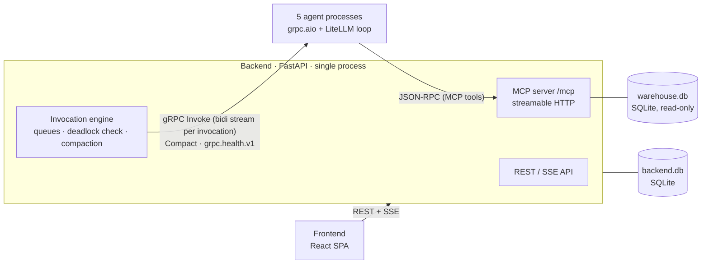
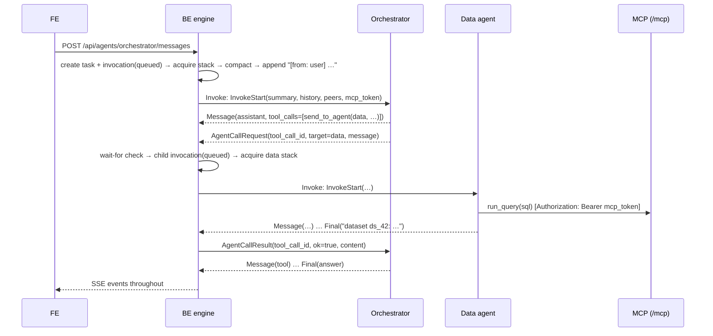

# vdagent — Multi-Agent Analytics Assistant (PoC) — Design Spec

Status: approved design, pre-implementation · Date: 2026-09-24

## 1. Purpose and scope

A Grok-bot-like proof of concept: a user asks analytics questions about a data warehouse; five
specialised LLM agents (Orchestrator, Data, Compare, Insight, Report) collaborate by messaging each
other through the Backend (BE). Every agent has one inspectable chat per user; the user can read it
and post into it to guide the agent.

In scope: Backend (FastAPI + MCP server + invocation engine), five agent services (gRPC), gRPC
protocol, MCP tool catalog, Backend DB and demo Warehouse DB (both SQLite), Frontend (React SPA),
local + docker-compose deployment, tests.

Out of scope for the PoC: authentication, group chat (protocol leaves room), token streaming,
multi-process / horizontally scaled BE, dataset garbage collection, SSE replay.

### 1.1 Decisions log

| # | Decision |
|---|---|
| D1 | Agent→agent calls are **synchronous** ("agent-as-tool"): the caller's `send_to_agent` tool call blocks until the callee's turn ends; the callee's final reply is the caller's tool result. |
| D2 | One **stack** (message history) per **(user, agent)**, shared across all of that user's tasks. Messages from finished tasks are **compacted** into a rolling summary at task boundaries. |
| D3 | One chat per agent per user in the UI; a chat is a view of that agent's stack. A human message in any agent's chat **triggers a turn** of that agent (queued if busy). Normally only the Orchestrator is driven by the human; other agents are driven by agents. |
| D4 | **BE DB is the single source of truth**; agents are stateless. The BE sends the (compacted) stack with each invocation. |
| D5 | Calls to a busy agent are **queued** (FIFO per stack). Calls that would deadlock (target transitively waiting on the caller, including ancestors) are **rejected** with a tool error. Max call depth 4. |
| D6 | Query results are passed between agents as **dataset handles** (`ds_…`) stored by the BE and accessed through MCP tools; messages carry ids + small previews, never bulk rows. |
| D7 | FE receives **message-level live events** over SSE (no token streaming). |
| D8 | Agent runtime: **thin custom loop over LiteLLM** (provider-agnostic; fits stateless agents). |
| D9 | Backend DB and Warehouse DB are both **SQLite**. |
| D10 | No auth: users are picked in the UI and identified by `X-User-Id`. |
| D11 | Compaction trigger: **task boundary** (lazily, when an agent next starts a turn). |
| D12 | BE↔agent topology: agents are **gRPC servers**; the BE opens **one bidirectional stream per invocation**; agent→agent calls travel as frames on that stream; health via standard `grpc.health.v1`. |
| D13 | Agent processes are **pure `grpc.aio`** (no FastAPI) — deviation from the original diagram, which showed FastAPI on each agent. |
| D14 | Python side uses a **uv workspace**; FE is **React + Vite + TypeScript** managed with npm. |

## 2. Architecture



### 2.1 Components

**Backend** — one FastAPI process. It MUST run as a single process (in-memory scheduler + SQLite).
- *REST/SSE API* (§10) for the FE; also serves the built FE (`frontend/dist`) at `/`.
- *Invocation engine* (§4) — owns every agent turn: per-stack locks and FIFO queues, wait-for
  graph / deadlock rejection, task tracking, compaction, persistence, SSE publication, agent health.
- *MCP server* (§6) at `/mcp` — warehouse and artifact tools; per-agent tool filtering; identity
  from a per-invocation bearer token.

**Agents** — one shared runtime package run as five processes (`AGENT_NAME=orchestrator|data|compare|insight|report`).
An agent owns only its "brain": system prompt, model, summarisation. It holds no state between
invocations and makes no routing or permission decisions.

**Frontend** — React SPA (§11).

### 2.2 Tech stack

| Area | Choice |
|---|---|
| Language | Python 3.12 |
| Python packaging | uv workspace (root `pyproject.toml`; members `proto`, `backend`, `agents`) |
| BE web | FastAPI, uvicorn, `sse-starlette` |
| BE DB access | SQLAlchemy Core (async) + `aiosqlite`; schema applied from `backend/db/schema.sql` at startup (`CREATE TABLE IF NOT EXISTS`) |
| gRPC | `grpcio`, `grpcio-tools` (codegen), `grpcio-health-checking`; `grpc.aio` on both sides |
| MCP | official `mcp` Python SDK (server in BE, streamable-HTTP client in agents) |
| LLM | LiteLLM (`litellm.acompletion`), model chosen by env |
| FE | React 18, Vite, TypeScript, npm, `@tanstack/react-query`, `react-markdown` + `remark-gfm`, `vega-embed` (+ `vega`, `vega-lite`), plain CSS |
| Tests | pytest + pytest-asyncio; Vitest (FE) |

### 2.3 Repository layout

```
pyproject.toml                # uv workspace root
proto/
  agent.proto
  pyproject.toml              # package `vdagent-proto`; generated stubs in vdagent_proto/
  scripts/gen.py              # uv run python proto/scripts/gen.py → grpc_tools.protoc
backend/
  pyproject.toml
  config.yaml
  vdagent_backend/
    app.py                    # FastAPI app factory, lifespan (startup recovery, health loop)
    config.py
    api/                      # REST + SSE routers
    engine/                   # scheduler, invocation runner, waitgraph, compaction, agent clients
    mcp/                      # MCP server, tools, auth middleware, permission matrix
    db/schema.sql
    db/repo.py                # queries
    events.py                 # per-user SSE fan-out
  tests/
agents/
  pyproject.toml
  vdagent_agents/
    server.py                 # grpc.aio server: Agent service + health
    loop.py                   # LLM tool loop
    llm.py                    # LLMClient protocol + LiteLLM implementation
    mcp_client.py
    prompts/{orchestrator,data,compare,insight,report,compact}.md
  tests/
data/
  seed_warehouse.py           # builds var/warehouse.db (seed 42)
  seed_users.py               # inserts demo users into var/backend.db
frontend/
  package.json, vite.config.ts, src/…
docker-compose.yml
Dockerfile.python             # one image for backend + agents + seed
var/                          # runtime DB files (gitignored)
```

## 3. Core concepts

- **User** — row in `users`. Identified on every request by `X-User-Id` (SSE: `?user_id=`).
- **Stack** — identified by `(user_id, agent)`. Everything that agent sees for that user, in order
  (`seq`): inbound messages from the human or other agents, its own assistant messages, tool calls,
  tool results. The UI chat for agent X is a view of stack `(user, X)`.
- **Task** — created whenever a **human** posts into any agent's chat. Every invocation in the
  resulting cascade shares its `task_id`. A task ends when its root invocation ends (completed /
  failed / cancelled).
- **Invocation** — one agent turn: from one inbound message to a final assistant message without
  tool calls. Has `parent_id`, `caller` (`user` or agent name), `depth` (root = 0), `status`:
  `queued → running → completed | failed | cancelled`, or `rejected` (never ran; see §4.4).
- **Inbound message rendering** — stored on the stack as `role=user` with `sender` set. When the BE
  builds the LLM history it renders the content as `[from: <sender>] <text>` (provider `name`
  fields are unreliable, so the sender goes into the text).
- **Agent reply to a caller** — the callee's final assistant text becomes the caller's `role=tool`
  result for its `send_to_agent` call.
- **Queued inbound text** is held on the invocation row (`inbound_text`) and appended to the stack
  only when the invocation **starts** — appending at enqueue time could land between another
  running turn's tool call and its tool result. The UI shows queued inbound messages as "pending".
- **Stack lock** — at most one running invocation per stack; others wait in that stack's FIFO queue
  regardless of origin (human or agent).
- **Datasets / charts / reports** — artifacts stored in `backend.db`, owned by the user of the
  invocation that created them, referenced by id (`ds_…`, `ch_…`, `rp_…`) in message text.

### 3.1 Invariants

- I1: A stack's messages are written only by the invocation currently holding that stack's lock
  (including failure patching done on its behalf). Therefore `seq = max(seq)+1` under the lock is safe.
- I2: Every assistant `tool_calls[i].id` on a stack has exactly one matching `role=tool` message
  after it, before the next assistant message of the same invocation; failure/cancel paths
  synthesise missing ones (§4.6).
- I3: The wait-for graph (§4.4) is acyclic at all times.
- I4: A dataset/chart/report is readable only by its owning user.

### 3.2 IDs and timestamps

IDs are `<prefix>_<12 lowercase hex>` from `secrets.token_hex(6)`: `u_`, `t_`, `inv_`, `ds_`, `ch_`, `rp_`.
Timestamps are UTC ISO-8601 text.

## 4. Invocation engine (BE)

### 4.1 Lifecycle



1. **Trigger.**
   - Human: `POST /api/agents/{agent}/messages` → create `task(status=running, root_agent)` and
     root `invocation(caller=user, depth=0, status=queued)`; respond `202`.
   - Agent: an `AgentCallRequest` frame on a running invocation's stream → validate (§5.3) → run
     the call checks (§4.4) → create child `invocation(parent_id, caller=<agent>, tool_call_id,
     depth=parent.depth+1, task_id=parent.task_id, status=queued)` or a `rejected` row.
2. **Schedule.** Invocation is pushed onto the in-memory FIFO of stack `(user, agent)`. When the
   stack is free, the head is dequeued and marked `running` (`started_at`).
3. **Prepare** (holding the stack lock):
   1. Compaction (§4.5).
   2. Append the inbound message (`role=user`, `sender=caller`, `content=inbound_text`).
   3. Issue `mcp_token` (random 32-byte urlsafe) → map `token → (user_id, agent, invocation_id)`.
   4. Open `Agent.Invoke` stream; send `InvokeStart` (§5).
4. **Run.** Consume `AgentFrame`s:
   - `message` → assign `seq`, persist, publish `message.appended`.
   - `call` → handled concurrently (one asyncio task per call); the eventual `AgentCallResult`
     is written back on the same stream. The caller-side wait-for edge exists from acceptance
     until the result is sent.
   - `final` → go to 5.
5. **Finish.** Mark `completed`, store `result_text = final.content`, revoke `mcp_token`, close
   stream. If `parent_id` → deliver `AgentCallResult{ok=true, content=result_text}` to the parent.
   If root → mark task `completed`. Release the stack lock → start the next queued invocation.

Every status change publishes `invocation.updated` / `task.updated`; queue/busy changes publish
`agent.status`.

### 4.2 Scheduling

- One `asyncio.Lock`-equivalent + `collections.deque` per `(user_id, agent)` (created lazily).
- FIFO regardless of origin.
- Parallel `send_to_agent` calls from one assistant step run concurrently; different targets run in
  parallel, same target serialises through its queue.

### 4.3 Agent clients and health

- One `grpc.aio` channel per agent from `config.yaml` addresses.
- Health loop every `health_interval_s` (10s): `grpc.health.v1.Health/Check(service="")`;
  healthy iff `SERVING`. Health changes publish `agent.status` to every connected user.
- Human post to an unhealthy agent → `503 agent_unavailable`.
- Agent call to an unhealthy agent → immediate `AgentCallResult{ok=false, content="error: <agent> is unavailable"}`
  (invocation row `rejected`, `error` set).
- Opening `Invoke` failing at runtime → invocation `failed` (§4.6).

### 4.4 Call checks (queue vs. reject)

The BE keeps a per-user **wait-for graph** over agents: edge `A → B` exists while a running
invocation of agent A has an accepted, unresolved call to B (queued or running). On
`AgentCallRequest` from invocation `C` (agent `c`) to target `x`, reject if any holds:

| Check | Tool-error content returned to caller |
|---|---|
| `x` not a known agent | `error: unknown agent '<x>'` |
| `x == c` | `error: you cannot call yourself` |
| `C.depth + 1 > max_depth` (4) | `error: call depth limit reached; answer your caller with what you have` |
| `x` is unhealthy | `error: <x> is unavailable` |
| path `x ⇝ c` exists in the wait-for graph (covers ancestors and cross-task cycles) | `error: calling <x> would deadlock (it is waiting on you); answer with what you have` |

Otherwise add edge `c → x` and enqueue. A rejected call creates an invocation row with
`status=rejected` and `error`, and immediately returns `AgentCallResult{ok=false, content=<message>}`.

Rationale for the graph instead of "ancestors only": with task 1 running `Orchestrator → Data → Compare`
while task 2 (human in Compare's chat) runs `Compare → Data`, Data waits on Compare and Compare waits
on Data, yet neither is the other's ancestor within its own chain. Because a queued invocation is
only ever blocked by its stack's running invocation, and a running invocation only by its outgoing
edges, an acyclic wait-for graph (I3) guarantees no deadlock.

### 4.5 Compaction (task boundary, lazy)

At invocation start (holding the stack lock), select messages on the stack with `compacted = 0`
whose task is finished (`completed|failed|cancelled`) and is not the current task. If none: skip.
Else call `Agent.Compact(previous_summary, messages)` on that agent; on success, in one DB
transaction upsert `stack_summaries.summary` and set `compacted = 1` on those rows. On failure: log,
continue without compacting (non-fatal).

The LLM context for an invocation is: system prompt + latest summary + uncompacted messages in `seq`
order. Compacting whole finished tasks never splits a tool-call/tool-result pair (pairs belong to
one invocation, hence one task, and finished tasks have no dangling calls — I2). Original messages
remain in the DB for the UI.

### 4.6 Failure, cancel, restart

**Invocation failure causes:** stream error / non-OK gRPC status from the agent (e.g.
`DEADLINE_EXCEEDED` for LLM timeout, `INTERNAL`), agent unreachable at open, protocol violation
(§5.3).

**Failure handling** (holding the stack lock):
1. For every assistant `tool_call` of this invocation without a `role=tool` result, append a
   synthetic `role=tool` message `error: turn aborted (<reason>)`.
2. Append synthetic assistant message `[turn failed: <reason>]`.
3. Mark invocation `failed` with `error`; revoke `mcp_token`; remove this invocation's outgoing
   wait-for edges. Outstanding child calls continue to completion, but their results are
   discarded (the parent stream is gone).
4. Parent → `AgentCallResult{ok=false, content="error: <agent> failed: <reason>"}`; root → task `failed`.
5. Release lock.

**Cancel** (`POST /api/tasks/{id}/cancel`): remove the task's queued invocations from their queues;
cancel running streams (`call.cancel()`); for each affected running invocation apply failure steps
1–2 with reason `cancelled`, revoke its `mcp_token`, remove its wait-for edges, and release its
stack lock; mark all the task's non-terminal invocations and the task `cancelled`.
No `AgentCallResult`s are delivered within a cancelled task.

**BE startup recovery:** every `queued`/`running` invocation → `failed` (`error="backend restarted"`)
with stack patching (steps 1–2); every `running` task → `failed`.

### 4.7 Timeouts and limits

| Limit | Value | Enforced by |
|---|---|---|
| `max_depth` | 4 | BE |
| `max_steps` (LLM calls per invocation) | 12 | agent (sent in `InvokeStart`) |
| LLM call timeout | 120 s (`LLM_TIMEOUT_S`) | agent → `DEADLINE_EXCEEDED` |
| MCP tool call timeout | 30 s | agent MCP client |
| SQL execution | 10 s | BE (SQLite progress handler) |
| Result rows per dataset | 10 000 | BE |
| MCP tool result text passed to the LLM | 16 000 chars, then truncated with `…[truncated]` | agent |
| Wait for `send_to_agent` result | none (bounded by depth, step caps, cancel) | — |

## 5. gRPC protocol

### 5.1 `proto/agent.proto`

```proto
syntax = "proto3";
package vdagent.v1;

service Agent {
  // BE opens one stream per invocation. The first BackendFrame MUST be `start`.
  rpc Invoke(stream BackendFrame) returns (stream AgentFrame);
  rpc Compact(CompactRequest) returns (CompactResponse);
}
// Health: standard grpc.health.v1.Health registered on the same server.

enum Role { ROLE_UNSPECIFIED = 0; USER = 1; ASSISTANT = 2; TOOL = 3; }

message ToolCall { string id = 1; string name = 2; string arguments_json = 3; }

message Message {
  Role role = 1;
  string content = 2;
  repeated ToolCall tool_calls = 3;   // assistant only
  string tool_call_id = 4;            // tool only
}

message Peer { string name = 1; string description = 2; }

message InvokeStart {
  string invocation_id = 1;
  string task_id = 2;
  string user_id = 3;
  string summary = 4;                 // rolling summary; empty if none
  repeated Message history = 5;       // uncompacted, seq order; last item = inbound message
  repeated Peer peers = 6;            // every other agent
  string mcp_url = 7;
  string mcp_token = 8;
  int32 max_steps = 9;
}

message AgentCallResult { string tool_call_id = 1; bool ok = 2; string content = 3; }

message BackendFrame {
  oneof kind { InvokeStart start = 1; AgentCallResult call_result = 2; }
}

message AgentCallRequest { string tool_call_id = 1; string target = 2; string message = 3; }
message Final { string content = 1; }

message AgentFrame {
  oneof kind { Message message = 1; AgentCallRequest call = 2; Final final = 3; }
}

message CompactRequest { string previous_summary = 1; repeated Message messages = 2; }
message CompactResponse { string summary = 1; }
```

History messages sent in `InvokeStart` and `CompactRequest` have `role=USER` content already
rendered as `[from: <sender>] <text>`.

### 5.2 Frame sequence (per invocation)

```
BE → start
loop:
  AG → message(assistant [+tool_calls])
  for each tool call (concurrently):
     MCP tool      → AG executes via MCP → AG → message(tool)
     send_to_agent → AG → call ; BE → call_result ; AG → message(tool)
AG → final
```

### 5.3 Validation (BE; any violation → invocation failed, reason `protocol error: …`)

- First `BackendFrame` is `start`; exactly one.
- `call.tool_call_id` refers to a `send_to_agent` tool call in the latest assistant `message` of
  this invocation that has no result yet; at most one `call` per such tool call.
- `message(tool).tool_call_id` refers to an unresolved tool call of the latest assistant message.
- `final` only when no tool call is unresolved; nothing after `final`.

### 5.4 Error signalling

Agent aborts the stream with gRPC status `DEADLINE_EXCEEDED` (LLM timeout) or `INTERNAL`
(anything else), with detail text. MCP tool errors are **not** invocation errors: they are returned
to the model as `role=tool` content `error: …`.

### 5.5 Future: group chat

Change `AgentCallRequest.target` to `repeated string targets` and aggregate replies into one
`AgentCallResult`. Nothing else changes.

## 6. MCP server (BE, `/mcp`)

- Transport: MCP streamable HTTP via the official `mcp` SDK, mounted into the FastAPI app.
- Auth: ASGI middleware requires `Authorization: Bearer <mcp_token>`; resolves
  `(user_id, agent, invocation_id)` from the in-memory token map (unknown/revoked → HTTP 401) and
  exposes it to tool handlers via a context variable.
- Per-agent filtering: `tools/list` returns only the caller's permitted tools; `tools/call` on a
  non-permitted tool returns an MCP tool error. (If the SDK's high-level `FastMCP` cannot filter per
  request, implement `list_tools`/`call_tool` with the SDK's low-level `Server`.)

### 6.1 Tool catalog

| Tool | Purpose | orch | data | compare | insight | report |
|---|---|:-:|:-:|:-:|:-:|:-:|
| `list_tables()` | warehouse tables + row counts | | ✓ | | | |
| `describe_table(table)` | columns, types, 5 sample rows | | ✓ | | | |
| `run_query(sql, name?)` | read-only SELECT on the warehouse → new dataset | | ✓ | | | |
| `describe_dataset(dataset_id)` | columns, row count, per-column min/max/null count | ✓ | ✓ | ✓ | ✓ | ✓ |
| `get_dataset_rows(dataset_id, offset=0, limit=50)` | page rows (`limit ≤ 200`) | ✓ | ✓ | ✓ | ✓ | ✓ |
| `query_datasets(sql, dataset_ids[], name?)` | SQL over datasets (each loaded as a table named by its id) → new dataset | | ✓ | ✓ | ✓ | |
| `create_chart(dataset_id, kind, x, y[], title)` | `kind ∈ {bar, line, pie}`; builds a Vega-Lite spec with data inlined → `chart_id` | | | | | ✓ |
| `save_report(title, markdown)` | stores report; markdown may embed `{{chart:<id>}}`, `{{dataset:<id>}}` → `report_id` | | | | | ✓ |

Dataset-producing tools return:
```json
{"dataset_id": "ds_…", "name": "…", "columns": [{"name": "region", "type": "TEXT"}],
 "row_count": 5, "truncated": false, "preview": [["North", 1234.5]]}
```
`preview` = first 20 rows. Unknown or other-user ids → tool error `error: dataset not found`.

### 6.2 SQL safety

- `run_query`: warehouse opened as `file:warehouse.db?mode=ro` (URI) with `PRAGMA query_only=ON`;
  exactly one statement, which must be a `SELECT` / `WITH … SELECT`
  (checked with `sqlite3.complete_statement` + leading-keyword check); 10 s limit via
  `set_progress_handler`; fetch at most 10 001 rows → keep 10 000, set `truncated`.
- `query_datasets`: fresh in-memory SQLite per call; referenced datasets loaded as tables named by
  dataset id (all columns created with their stored types); same statement/timeout/row rules.
- Column types for new datasets come from `cursor.description` + first non-null value
  (`INTEGER | REAL | TEXT`).

### 6.3 Charts

`create_chart` validates `x` and every `y` exist in the dataset; produces Vega-Lite v5:
bar/line → `mark: bar|line`, `x` nominal/temporal (temporal if the column name contains `date` or
values parse as ISO dates), `y` quantitative, multiple `y` via `fold`; pie → `mark: arc`,
`theta = y[0]`, `color = x`. Data inlined from the dataset (max 10 000 rows).

## 7. Agent service

### 7.1 Process

`python -m vdagent_agents.server` with env: `AGENT_NAME` (required), `GRPC_PORT` (default 50051),
`LLM_MODEL` (required; any LiteLLM model string — no default is assumed), provider API key env
(per LiteLLM), `LLM_TIMEOUT_S` (default 120). Registers the `Agent` service and `grpc.health.v1`
(set `SERVING` after startup). System prompt: `prompts/<AGENT_NAME>.md`; summariser prompt:
`prompts/compact.md`.

### 7.2 `Invoke` loop

1. Read `start`. Open an MCP client session (`streamable HTTP`, header
   `Authorization: Bearer <mcp_token>`) and `list_tools`.
2. Build LLM messages:
   - `system`: prompt file + (if summary) `\n\n## Summary of earlier work with this user\n<summary>`.
   - history → OpenAI-shaped messages (`user` / `assistant` with `tool_calls` / `tool` with `tool_call_id`).
3. Tools = MCP tools (their JSON schemas) + `send_to_agent`:
   ```json
   {"type": "function", "function": {
     "name": "send_to_agent",
     "description": "Send a message to another agent and wait for its reply. Agents:\n- data: …\n- …",
     "parameters": {"type": "object", "properties": {
        "agent": {"type": "string", "enum": ["<peer names>"]},
        "message": {"type": "string", "description": "Self-contained request, including any dataset ids it needs."}},
      "required": ["agent", "message"]}}}
   ```
4. For `step = 1..max_steps`: call the LLM (`tool_choice="none"` when `step == max_steps`) →
   emit `message(assistant)`. No tool calls → emit `final(content)` and return. Else run all tool
   calls concurrently: MCP tools via the session (errors → `error: …` content), `send_to_agent`
   → emit `call`, await matching `call_result`, content = result content. Emit each
   `message(tool)` as it completes. Invalid tool-call JSON or unknown tool name → tool result
   `error: …` (the model can retry).
5. LLM timeout → abort `DEADLINE_EXCEEDED`; other exceptions → abort `INTERNAL`.

The LLM is called through an `LLMClient` protocol (`async complete(messages, tools, tool_choice) → assistant message`);
the default implementation wraps `litellm.acompletion`. Tests inject a scripted fake.

### 7.3 `Compact`

One LLM call: `system = prompts/compact.md`, user content = previous summary + rendered messages.
The prompt instructs: keep user preferences and guidance, questions asked and answers given,
artifact ids (`ds_/ch_/rp_`) with one-line descriptions, unresolved issues; ≤ 400 words.

### 7.4 Role prompts (content requirements)

All prompts: you are one of five agents; messages prefixed `[from: user]` come from the human,
others from agents; replies to an agent must be self-contained and cite artifact ids; never paste
bulk rows — reference datasets.

| Agent | Responsibilities |
|---|---|
| Orchestrator | Understand the user's request, plan, delegate via `send_to_agent`, write the final answer referencing artifacts. Never writes SQL. |
| Data | Explore schema (`list_tables`, `describe_table`), write SQLite SQL, `run_query`; reply with dataset ids, column meaning, caveats. No interpretation. |
| Compare | Given dataset ids, compute deltas / % change / rankings with `query_datasets`; may ask Data for missing data; reply with new dataset ids and key numbers. |
| Insight | Interpret results (trends, anomalies, drivers); may ask Data/Compare; reply with findings, each backed by a dataset id. |
| Report | Build charts (`create_chart`) and a markdown report (`save_report`) from provided findings/datasets; reply with the report id. |

## 8. Backend DB schema (`backend.db`)

Pragmas at connect: `journal_mode=WAL`, `foreign_keys=ON`, `busy_timeout=5000`. The agent registry
lives in `config.yaml`, not the DB. `mcp_token`s live only in memory.

```sql
CREATE TABLE IF NOT EXISTS users (
  id          TEXT PRIMARY KEY,               -- 'u_…'
  name        TEXT NOT NULL,
  created_at  TEXT NOT NULL DEFAULT (strftime('%Y-%m-%dT%H:%M:%fZ','now'))
);

CREATE TABLE IF NOT EXISTS tasks (
  id          TEXT PRIMARY KEY,               -- 't_…'
  user_id     TEXT NOT NULL REFERENCES users(id),
  root_agent  TEXT NOT NULL,                  -- agent whose chat the human posted in
  status      TEXT NOT NULL CHECK (status IN ('running','completed','failed','cancelled')),
  created_at  TEXT NOT NULL DEFAULT (strftime('%Y-%m-%dT%H:%M:%fZ','now')),
  finished_at TEXT
);
CREATE INDEX IF NOT EXISTS ix_tasks_user ON tasks(user_id, created_at);

CREATE TABLE IF NOT EXISTS invocations (
  id           TEXT PRIMARY KEY,              -- 'inv_…'
  task_id      TEXT NOT NULL REFERENCES tasks(id),
  user_id      TEXT NOT NULL REFERENCES users(id),
  agent        TEXT NOT NULL,                 -- callee = stack owner
  caller       TEXT NOT NULL,                 -- 'user' or agent name
  parent_id    TEXT REFERENCES invocations(id),
  tool_call_id TEXT,                          -- parent's send_to_agent tool call id
  depth        INTEGER NOT NULL,
  inbound_text TEXT NOT NULL,
  status       TEXT NOT NULL CHECK (status IN ('queued','running','completed','failed','cancelled','rejected')),
  result_text  TEXT,
  error        TEXT,
  created_at   TEXT NOT NULL DEFAULT (strftime('%Y-%m-%dT%H:%M:%fZ','now')),
  started_at   TEXT,
  finished_at  TEXT
);
CREATE INDEX IF NOT EXISTS ix_inv_task  ON invocations(task_id);
CREATE INDEX IF NOT EXISTS ix_inv_stack ON invocations(user_id, agent, status);

CREATE TABLE IF NOT EXISTS messages (
  id              INTEGER PRIMARY KEY AUTOINCREMENT,
  user_id         TEXT NOT NULL REFERENCES users(id),
  agent           TEXT NOT NULL,              -- stack = (user_id, agent)
  seq             INTEGER NOT NULL,           -- per-stack order, starts at 1
  task_id         TEXT NOT NULL REFERENCES tasks(id),
  invocation_id   TEXT NOT NULL REFERENCES invocations(id),
  role            TEXT NOT NULL CHECK (role IN ('user','assistant','tool')),
  sender          TEXT,                       -- role=user: 'user' or agent name
  content         TEXT NOT NULL DEFAULT '',   -- raw text (no [from:] prefix)
  tool_calls_json TEXT,                       -- role=assistant: [{"id","name","arguments_json"}]
  tool_call_id    TEXT,                       -- role=tool
  compacted       INTEGER NOT NULL DEFAULT 0 CHECK (compacted IN (0,1)),
  created_at      TEXT NOT NULL DEFAULT (strftime('%Y-%m-%dT%H:%M:%fZ','now')),
  UNIQUE (user_id, agent, seq)
);
CREATE INDEX IF NOT EXISTS ix_msg_task ON messages(task_id);

CREATE TABLE IF NOT EXISTS stack_summaries (
  user_id    TEXT NOT NULL REFERENCES users(id),
  agent      TEXT NOT NULL,
  summary    TEXT NOT NULL,
  updated_at TEXT NOT NULL DEFAULT (strftime('%Y-%m-%dT%H:%M:%fZ','now')),
  PRIMARY KEY (user_id, agent)
);

CREATE TABLE IF NOT EXISTS datasets (
  id            TEXT PRIMARY KEY,             -- 'ds_…'; also its table name in query_datasets
  user_id       TEXT NOT NULL REFERENCES users(id),
  invocation_id TEXT NOT NULL REFERENCES invocations(id),
  name          TEXT,
  source_sql    TEXT NOT NULL,
  columns_json  TEXT NOT NULL,                -- [{"name","type"}]
  rows_json     TEXT NOT NULL,                -- [[…], …], ≤ 10 000 rows
  row_count     INTEGER NOT NULL,
  truncated     INTEGER NOT NULL DEFAULT 0 CHECK (truncated IN (0,1)),
  created_at    TEXT NOT NULL DEFAULT (strftime('%Y-%m-%dT%H:%M:%fZ','now'))
);
CREATE INDEX IF NOT EXISTS ix_ds_user ON datasets(user_id);

CREATE TABLE IF NOT EXISTS charts (
  id            TEXT PRIMARY KEY,             -- 'ch_…'
  user_id       TEXT NOT NULL REFERENCES users(id),
  invocation_id TEXT NOT NULL REFERENCES invocations(id),
  dataset_id    TEXT NOT NULL REFERENCES datasets(id),
  title         TEXT NOT NULL,
  spec_json     TEXT NOT NULL,                -- Vega-Lite v5, data inlined
  created_at    TEXT NOT NULL DEFAULT (strftime('%Y-%m-%dT%H:%M:%fZ','now'))
);

CREATE TABLE IF NOT EXISTS reports (
  id            TEXT PRIMARY KEY,             -- 'rp_…'
  user_id       TEXT NOT NULL REFERENCES users(id),
  invocation_id TEXT NOT NULL REFERENCES invocations(id),
  title         TEXT NOT NULL,
  markdown      TEXT NOT NULL,
  created_at    TEXT NOT NULL DEFAULT (strftime('%Y-%m-%dT%H:%M:%fZ','now'))
);
CREATE INDEX IF NOT EXISTS ix_rp_user ON reports(user_id, created_at);
```

Key queries:
- Stack history for `InvokeStart`: `SELECT … FROM messages WHERE user_id=? AND agent=? AND compacted=0 ORDER BY seq`.
- Compaction candidates: `… WHERE m.user_id=? AND m.agent=? AND m.compacted=0 AND m.task_id<>:current AND t.status<>'running'` (join `tasks t`).

## 9. Warehouse DB (`warehouse.db`, read-only)

Built by `data/seed_warehouse.py` (Python `random.Random(42)`; deterministic).

```sql
CREATE TABLE dim_date (
  date_key INTEGER PRIMARY KEY,               -- yyyymmdd
  date TEXT NOT NULL, year INTEGER, quarter INTEGER, month INTEGER,
  month_name TEXT, iso_week INTEGER, day_of_week INTEGER, is_weekend INTEGER);
CREATE TABLE dim_product (
  product_key INTEGER PRIMARY KEY, sku TEXT UNIQUE, name TEXT,
  category TEXT, subcategory TEXT, brand TEXT, unit_cost REAL, list_price REAL);
CREATE TABLE dim_store (
  store_key INTEGER PRIMARY KEY, name TEXT, city TEXT, region TEXT,
  format TEXT CHECK (format IN ('mall','street','online')), opened_date TEXT);
CREATE TABLE fact_sales (
  sale_id INTEGER PRIMARY KEY,
  date_key INTEGER REFERENCES dim_date(date_key),
  product_key INTEGER REFERENCES dim_product(product_key),
  store_key INTEGER REFERENCES dim_store(store_key),
  quantity INTEGER, unit_price REAL, discount REAL, revenue REAL, cost REAL);
CREATE INDEX ix_sales_date    ON fact_sales(date_key);
CREATE INDEX ix_sales_product ON fact_sales(product_key);
CREATE INDEX ix_sales_store   ON fact_sales(store_key);
```

Size: fixed calendar years 2024–2025 (731 dates), ~60 products in 5 categories, 12 stores in
4 regions (incl. 1 online), ~150k sales rows.
`revenue = quantity * unit_price * (1 - discount)`, `cost = quantity * unit_cost`.

Planted patterns (so Compare/Insight have something to find):
1. Q4 seasonality (+35% volume Nov–Dec).
2. One promo week per year (one category, discount 0.3, 3× volume).
3. One store declining steadily (−40% over the 2 years).
4. One category growing faster than the rest (+60% YoY vs ~+8%).

`data/seed_users.py` inserts `u_000000000001` "Alice" and `u_000000000002` "Bob" (idempotent).

## 10. REST / SSE API

Identity: REST uses header `X-User-Id` (unknown → `401 unknown_user`); SSE uses `?user_id=`.
Errors: `{"error": {"code": "<snake_case>", "message": "<text>"}}`. Resources of another user → `404`.

| Method & path | Body / query | Response |
|---|---|---|
| `GET /api/users` | — | `[{id, name}]` (no `X-User-Id` needed) |
| `POST /api/users` | `{name}` | `201 {id, name}` (no `X-User-Id` needed) |
| `GET /api/agents` | — | `[{name, description, healthy, busy, queue_len}]` (`busy`/`queue_len` for this user's stack) |
| `GET /api/agents/{agent}/messages` | `?before_seq=&limit=50` (max 200) | `{summary, messages: [MessageDTO], pending: [{invocation_id, caller, inbound_text, created_at}]}` — newest page, ascending `seq`; compacted messages included |
| `POST /api/agents/{agent}/messages` | `{content}` (non-empty) | `202 {task_id, invocation_id}`; `404 unknown_agent`; `503 agent_unavailable` |
| `GET /api/tasks` | `?status=` | `[TaskDTO]`, newest first, max 50 |
| `GET /api/tasks/{id}` | — | `{task: TaskDTO, invocations: [InvocationDTO]}` (flat; FE builds tree via `parent_id`) |
| `POST /api/tasks/{id}/cancel` | — | `200 {task}`; `409 task_finished` |
| `GET /api/datasets/{id}` | `?offset=0&limit=200` (max 1000) | `{id, name, columns, row_count, truncated, source_sql, rows}` |
| `GET /api/charts/{id}` | — | `{id, title, dataset_id, spec}` |
| `GET /api/reports` | — | `[{id, title, created_at}]` |
| `GET /api/reports/{id}` | — | `{id, title, markdown, created_at}` |
| `GET /api/events` | `?user_id=` | SSE stream |
| `POST/GET /mcp` | MCP JSON-RPC | agents only (§6) |

DTOs:
```ts
MessageDTO    = {id, seq, task_id, invocation_id, role: "user"|"assistant"|"tool", sender: string|null,
                 content, tool_calls: {id, name, arguments_json}[] | null, tool_call_id: string|null,
                 compacted: boolean, created_at}
TaskDTO       = {id, root_agent, status, created_at, finished_at}
InvocationDTO = {id, task_id, agent, caller, parent_id, tool_call_id, depth, inbound_text,
                 status, result_text, error, created_at, started_at, finished_at}
```

SSE events (`event:` name, `data:` JSON), only for the subscribed user (except `agent.status`
health changes, broadcast to all):

| Event | Data |
|---|---|
| `message.appended` | `{agent, message: MessageDTO}` |
| `invocation.updated` | `{invocation: InvocationDTO}` |
| `task.updated` | `{task: TaskDTO}` |
| `agent.status` | `{agent, healthy, busy, queue_len}` |

Keep-alive comment `: ping` every 15 s. Per-subscriber bounded queue (1000); on overflow the
subscriber is closed (FE reconnects and refetches). No replay.

## 11. Frontend

### 11.1 Tooling

`frontend/`: Vite + React 18 + TypeScript, npm. Dependencies: `@tanstack/react-query`,
`react-markdown`, `remark-gfm`, `vega-embed`, `vega`, `vega-lite`; dev: `vitest`. Plain CSS (one
stylesheet); no router, no UI kit. Dev: Vite proxy `/api` → `http://localhost:8000` (SSE
included). Demo/compose: BE serves `frontend/dist` at `/` (same origin, no CORS).

### 11.2 Layout

```
┌──────────────┬───────────────────────────────┬──────────────────────┐
│ User ▾       │  Data agent        ● busy (2) │  Inspector           │
│──────────────│───────────────────────────────│  [Task] [Artifact]   │
│ Agents       │  ── summarized (3 tasks) ──   │                      │
│ ● orchestr.  │  [from: orchestrator] …       │  Task t_91 running ✕ │
│ ● data  ⟳ 2  │  assistant: …                 │   orchestrator ✓     │
│ ● compare    │   ▸ run_query(sql)  → ds_42   │    └ data ⟳          │
│ ● insight    │  [pending] from compare: …    │       └ compare ⏳    │
│ ● report     │                               │                      │
│──────────────│                               │  ds_42 table / chart │
│ Tasks        │───────────────────────────────│  / report viewer     │
│ t_91 ⟳ t_90 ✓│  [ message data agent…  ][➤]  │                      │
└──────────────┴───────────────────────────────┴──────────────────────┘
```

### 11.3 Modules

- `api/types.ts` — DTOs mirroring §10.
- `api/client.ts` — typed `fetch` wrapper adding `X-User-Id`; parses the error envelope.
- `events/applyEvent.ts` — pure reducer `applyEvent(queryClient, event)`:
  `message.appended` → append to `['messages', agent]` (dedupe by `id`);
  `invocation.updated` → update that agent's `pending` (add when `queued`, remove otherwise) and
  `['task', task_id]`; `task.updated` → upsert in `['tasks']` and `['task', id]`;
  `agent.status` → patch `['agents']`.
- `events/useEventStream.ts` — one `EventSource` per selected user; on (re)open invalidates all
  queries; feeds `applyEvent`.
- Components:
  - `UserPicker` — select or create user; selection persisted in `localStorage`.
  - `AgentList` — health dot, busy spinner, queue length; selects the chat.
  - `TaskList` — recent tasks with status; selects the task in the Inspector.
  - `ChatPane` — `CompactedDivider` (collapsible; shows summary and greys compacted messages),
    `MessageItem` (inbound with sender badge; assistant as markdown with tool-call chips;
    collapsible tool results), `PendingItem`, infinite scroll upward via `before_seq`.
  - `Composer` — posts to the selected agent; disabled when the agent is unhealthy.
  - `TaskTree` — invocation tree (status icon, agent, caller, error tooltip), cancel button.
  - `DatasetTable` (paged), `ChartView` (`vega-embed`), `ReportView` (markdown; `{{chart:id}}` /
    `{{dataset:id}}` rendered as `ChartView` / `DatasetTable`).
- Artifact linking: `ds_…`, `ch_…`, `rp_…` tokens in any message are rendered as links that open the
  Inspector's Artifact tab.

## 12. Configuration and deployment

`backend/config.yaml` (env overrides with prefix `VDAGENT_`, e.g. `VDAGENT_BACKEND_DB`):
```yaml
backend_db: ./var/backend.db
warehouse_db: ./var/warehouse.db
mcp_public_url: http://localhost:8000/mcp      # URL agents use to reach MCP
frontend_dist: ./frontend/dist                  # served at / if present
max_depth: 4
max_steps: 12
health_interval_s: 10
agents:
  orchestrator: {address: localhost:50051, description: "Talks to the user, plans, delegates, writes final answers."}
  data:         {address: localhost:50052, description: "Queries the warehouse; returns dataset ids."}
  compare:      {address: localhost:50053, description: "Compares datasets, periods and segments."}
  insight:      {address: localhost:50054, description: "Explains trends, anomalies and drivers."}
  report:       {address: localhost:50055, description: "Builds formatted reports with charts."}
```
The MCP permission matrix (§6.1) lives in code next to the tool definitions.

Local run:
```
uv sync
uv run python proto/scripts/gen.py
uv run python data/seed_warehouse.py && uv run python data/seed_users.py
uv run uvicorn vdagent_backend.app:app --port 8000
AGENT_NAME=data GRPC_PORT=50052 LLM_MODEL=… uv run python -m vdagent_agents.server   # ×5
cd frontend && npm install && npm run dev
```

`docker-compose.yml`: `seed` (one-shot), `backend` (:8000, depends on seed; builds and serves the
FE via a multi-stage build), five agent services from one Python image differing in `AGENT_NAME`
(each `GRPC_PORT=50051`, addressed by service name via a compose-specific config override); shared
`./var` volume; `LLM_MODEL` and provider key passed from `.env`.

## 13. Testing

No real LLM in automated tests.

**Backend engine** (fake in-process `Agent` gRPC server replaying scripted frames):
- FIFO per stack; human message queued behind a running agent call.
- Parallel calls to different targets run concurrently.
- Rejections: self call, depth limit, unknown/unhealthy target, ancestor cycle, cross-task
  wait-for cycle (§4.4 example).
- Protocol violations → invocation failed; stack patched (I2).
- Failure of a child → parent receives `ok=false`.
- Cancel: queued removed, running cancelled, stacks patched, statuses `cancelled`.
- Startup recovery marks in-flight work failed and patches stacks.
- Compaction selects only finished, other-task, uncompacted messages; Compact failure is non-fatal.

**MCP**: `INSERT`/`PRAGMA`/multi-statement rejected; 10k row cap + `truncated`; 10 s timeout;
per-agent `tools/list` filter and `tools/call` rejection; other-user dataset → not found;
`query_datasets` joining two datasets; invalid/revoked token → 401.

**Agent runtime** (scripted `LLMClient`, fake MCP): terminates at `max_steps` with
`tool_choice="none"` on the last step; concurrent `send_to_agent` calls each produce a `call` and
consume the matching `call_result`; MCP results emitted as `message(tool)`; MCP error becomes tool
content; `Compact` returns the summary.

**Frontend**: `tsc --noEmit`, `vite build`, Vitest for `applyEvent` only.

**E2E smoke** (manual, needs `LLM_MODEL` + key): in the browser pick Alice, ask the Orchestrator
"Compare revenue by region in 2025 vs 2024 and write a report"; expect a task tree
Orchestrator → Data → Compare → Insight → Report, a saved report with at least one chart, and all
five chats showing their part of the exchange.
